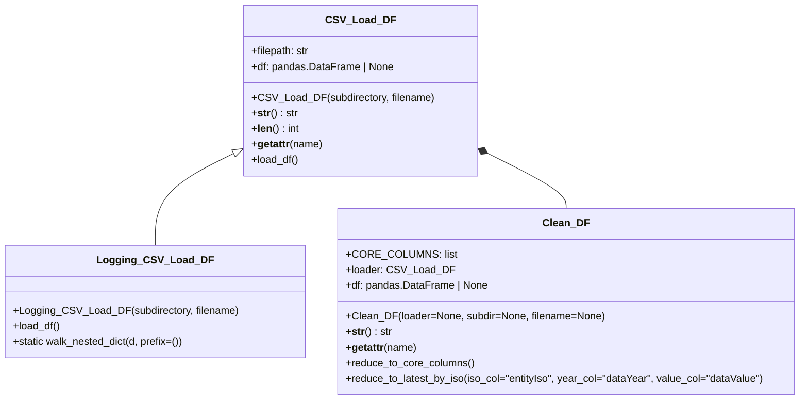
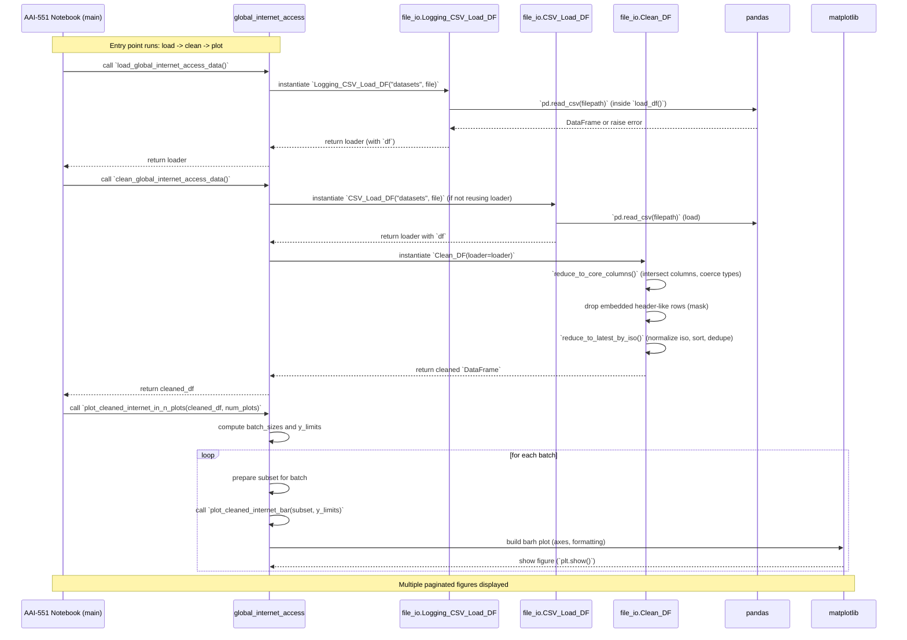

# AAI-551-Final-Project
# Evaluating the Digital Divide - Characterizing the Key Underlying Aspects that Drive Disparities in Access

## Team Members
|---------------|--------------------------|------------|---------------|
|      NAME     |       EMAIL ADDRESS      | STEVENS ID |    GitHub ID  |
|---------------|--------------------------|------------|---------------|
| Jeff Busold   | jbusold@stevens.edu      |  20006079  |  OverkillLC   |
| James Scott   | james.p.scott@boeing.com |  10311319  | james-p-scott |
| Dominick Vovk | dvovk1015@gmail.com      |  20002381  | domvovk       |
|---------------|--------------------------|------------|---------------|

## Problem Description
### Project Overview
The Digital Divide refers to the gap between those individuals, households, and populations that have access to modern information and communications technology (ICT) and those that do not.  In this context, ICT refers to broadband Internet access, modern computing devices, and the digital literacy required to access and use these capabilities.  According to statistics collected by the International Telecommunication Union (ITU), approximately 2.2 billion of the earth’s 8.3 billion human population remain unconnected, primarily residing in developing countries.  The key drivers behind the Digital Divide are economic disparity (e.g. the cost of modern computers and Internet subscriptions), geographic limitations (e.g. urban vs rural), digital literacy (e.g. lack of technology training) and education (e.g. budget shortfalls in lower income school districts), and demographic factors (e.g. age, disabilities, barriers to access based on social or cultural attributes).
This project proposes to analyze at least three (3) key aspects that drive the Digital Divide, selected from the following list and based on team member interests:
a)	Extend past research to predict the size and growth rate of the Digital Divide, circa 2026
b)	Evaluate the impact of economic disparities on the size and growth rate of the Digital Divide, based on the available dataset
c)	Evaluate the impact of digital literacy and skills on the size and growth rate of the Digital Divide, based on the available dataset
d)	Evaluate the impact of educational gaps on the size and growth rate of the Digital Divide, based on the available dataset
e)	Evaluate the impact of age and demographic factors on the size and growth rate of the Digital Divide, based on the available dataset

### Project Dependencies
- Determining which of te above key aspects a team member chooses to address depends on first gaining familiarity with the publicly available datasets listed below
- Prior to beginning code development, each team member must document their class definitions, functions, and key algorithms and data structures to be used by their Python code
- Before checking project artifacts into the GitHub repo, each team member must understand how to use GitHub
- Data from the datasets must be loaded from the public dataset into a suitable dataframe for processing
- Each team member must update the project README.md file when they commit new or modified (properly documented) code into the GitHub repo

### External Libraries
 - Matplotlib - an open-source library used to provide python data visualization capabilities
 - Pandas - an open-source library used for data manipulation, analysis, and cleaning
 - Pytest - an open-source library used to provide python with a unit-testing framework
 - PyTorch - an open-source ML framework used to build and train neural networks in Python

### Built-In Libraries
 - datatime - a built-in python standard library that provides specialized classes for manipulating dates, times, and time intervals
 - importlib - a built-in python standard library that provides a programmatic interface for interacting with the Python import system
 - math - a built-in python standard library that provides math functions and constants for real numbers
 - os - a built-in python standard library that provides portable methods for interacting with the underlying operating system (os)
 - statistics - a built-in python standard library used for calculating statistics of numeric data
 - sys - a built-in python standard library that provides access to variables and functions used by the Python interpreter
 - Warnings - a built-in python standard library used to notify users and developers of non-critical issues encountered at run-time

### File/Module Structure
The main function resides in AAI-551-Final-Project.ipynb with all other classes and functions contained in .py files that are imported into the proper namespace.

```
AAI-551_Final-Project.ipynb         — main program (entry point)
file_io.py                          — CSV data loading utility (CSV_Load_DF, Logging_CSV_Load_DF, and Clean_DF classes)
global_internet_access.py           — global internet access analysis and visualization module
load_ict_data.py                    — ICT data loading helpers
tests/
    test_data_cleaing.py            - pytest test suite for the data cleaning functions in the main branch
digital_skills/                     — digital literacy & ICT skills analysis package
    __init__.py                     — package exports
    ict_skills_dataset.py           — ICTSkillsDataset class (loads one ITU skill-category CSV)
    digital_skills_analyzer.py      — DigitalSkillsAnalyzer class (cross-category analysis & visualization)
    digital_skills_analysis.py      — top-level entry-point functions called from the notebook
    digital_literacy_predictor.py   — DigitalLiteracyPredictor class (linear regression forecasting)  
    tests/
        test_ict_skills.py          — pytest test suite for the digital_skills package
datasets/                           — ITU CSV data files
```

### Python Version Used
Python 3.14.3

## Publicly Available Datasets
### Primary Dataset Used
1. The International Telecommunications Union (ITU) provides a public dataset (1975-2025) of annual Digital Divide related statistics. https://datahub.itu.int

### Alternative Dataset Sources Available for use (not used by this Final Project but included for completeness)
2. The United Nations provides a large collection of public datasets (2010-2025), one of which reflects the global population, per country. https://data.un.org 
3. The World Bank provides a dataset (1960-2025) that relate to economic indicators for each country in the world https://datacatalog.worldbank.org/home  

## How to Run the Program
1. Clone the repository and open `AAI-551_Final-Project.ipynb` in Jupyter or VS Code.
2. Ensure the `datasets/` directory is present at the project root with all ITU CSV files.
3. Install required libraries: `pip install pandas numpy matplotlib torch pytest`
4. Run all notebook cells in order.

To run the pytest test suite:
```
python -m pytest digital_skills/tests/ -v
```
*(to be updated with additional test cases as development progresses)*

## Main Contributions of Each Team Member

### Jeff Busold — Digital Literacy & ICT Skills Analysis
Analyzed the impact of digital literacy and ICT skills on the Digital Divide using ITU skill-category datasets. Contributions include:
- `digital_skills/ict_skills_dataset.py` — `ICTSkillsDataset` class: loads a single ITU ICT skill-category CSV and provides filtered views by country, year, gender, age group, and urban/rural geography.
- `digital_skills/digital_skills_analyzer.py` — `DigitalSkillsAnalyzer` class: composes multiple `ICTSkillsDataset` instances to enable cross-category ranking, skill gap identification, trend analysis, gender gap analysis, age-group distribution analysis, and matplotlib visualizations.
- `digital_skills/digital_skills_analysis.py` — top-level entry-point functions (`load_all_ict_skill_datasets`, `load_skill_level_summary`, `iter_country_data`, `run_digital_literacy_analysis`) called directly from the project notebook.
- `digital_skills/digital_literacy_predictor.py` — `DigitalLiteracyPredictor` class: uses historical ITU skill-category data to train a simple linear regression model for predicting future digital literacy levels and plotting growth forecasts.
- `digital_skills/__init__.py` — package exports for the above classes and functions.
- `digital_skills/tests/` — pytest test suite

### James Scott
#### Class Diagram - Global Internet Access Analysis
'''

#### Summary of Workflow for Global Internet Access analysis
This code contains the end-to-end utilities used to (a) load the ITU global internet access dataset (.csv format), (b) clean and normalize the dataset into
a sorted dataframe that can be plotted, and (c) create a series of horizontal bar charts that indentify the % of individual internet usage by the population
of each country on earth.

Primary Modules and Entry Point:
1.  AAI-551_Final-Project.ipynb
    Notebook entry: imports global_internet_access and runs the three-step orchestration (load → clean → plot) guarded by if \_\_name\_\_ == "\_\_main\_\_":
2.  global_internet_access.py
    Top-level of hierarchy: load_global_internet_access_data(), clean_global_internet_access_data(), plot_cleaned_internet_bar(),
    plot_all_cleaned_internet_bars(), plot_cleaned_internet_in_n_plots().
    Responsibilities: orchestrate file loading via file_io classes, apply cleaning rules (drop embedded headers, normalize percentages, keep latest by ISO), 
    and plot results with consistent axes and batching.
3.  file_io.py
    Classes: CSV_Load_DF (base loader), Logging_CSV_Load_DF (subclass that logs), Clean_DF (composition-based cleaner).
    Responsibilities: build file path, read CSV into pandas.DataFrame, provide attribute delegation (__getattr__), operator overloads (__len__, __str__),
    error handling for read failures, and DataFrame cleaning utilities (reduce_to_core_columns, reduce_to_latest_by_iso).

Orchestration and Workflow:
1.  Load raw CSV
    load_global_internet_access_data() (via Logging_CSV_Load_DF) constructs filepath, attempts pd.read_csv, prints sample rows and flattened metadata via
    walk_nested_dict, and returns the loader whose df holds the raw DataFrame (or None on failure).
2.  Build cleaner and reduce to core schema
    clean_global_internet_access_data() constructs a CSV_Load_DF loader (or uses an existing one) and a Clean_DF wrapper that holds a working copy of loader.df.
    Calls reduce_to_core_columns() to:
        (a) compute intersection with CORE_COLUMNS,
        (b) drop other columns (or create empty DataFrame if no core columns),
        (c) coerce dataValue and dataYear to numeric (nullable year dtype), and
        (d) return/assign the reduced DataFrame.
3.  Remove embedded header rows and keep latest per ISO
    Detect rows where any cell equals its column name (case-insensitive); drop those rows.
    Call reduce_to_latest_by_iso() to:
        (a) coerce value and year columns,
        (b) drop rows with invalid values,
        (c) normalize ISO codes (uppercase, stripped),
        (d) sort by ISO and year descending,
        (e) keep the most recent row per ISO and assign it back to self.df
4.  Normalize values and sort
    Convert dataValue from percent to fraction if values > 1.0 (in both cleaner and plotting helpers).
    Sort cleaned data by dataValue descending.
5.  Plotting (using multiple helpers)
    plot_cleaned_internet_bar(df, ...):
        (a) validate input,
        (b) coerce numeric,
        (c) drop NaNs,
        (d) restrict to top_n,
        (e) draw a horizontal bar chart with percentage-formatted x-axis,
        (f) optionally enforce fixed y_limits.
    plot_all_cleaned_internet_bars(df, batch_size=...):
        (a) compute a global y-range from the entire dataset (clamped to [0,1]),
        (b) split sorted data into batches of batch_size,
        (c) call plot_cleaned_internet_bar() for each batch using shared y_limits.
    plot_cleaned_internet_in_n_plots(df, num_plots=...):
        (a) divide sorted data into num_plots batches (first P-1 get base rows, final gets base + remainder),
        (b) compute consistent y_limits,
        (c) call the bar plot helper for each batch.
6.  The Jupyter Notebook cell used for global internet access orchestration runs the loader, cleans the df, and plots the cleaned/sorted dataset

#### Sequence Diagram of Workflow - Global Internet Access Analysis

#### Horizontal Bar Plots of ITU Dataset (% individual usage per country) - Global Internet Access Analysis


### Dominick Vovk — Mobile Internet Price Regulation Analysis

This section analyzes mobile Internet/data price regulation as a policy and affordability factor in the Digital Divide. The ITU dataset is filtered to the indicator **Price regulation of retail Internet access and data services**. The cleaned regulation data is then merged with the existing `individuals-using-the-internet.csv` dataset so that countries with and without price control can be compared by internet usage.

### Files

- `price_regulation/price_regulation_dataset.py` — loads, cleans, filters, and merges the ITU datasets.
- `price_regulation/price_regulation_analyzer.py` — calculates summary statistics, finds low-access countries without price control, ranks countries, and creates charts.
- `price_regulation/price_regulation_analysis.py` — top-level runner for the notebook.
- `price_regulation/tests/` — pytest unit tests for the dataset and analyzer classes.

### Notebook cells

```python
from price_regulation.price_regulation_analysis import run_price_regulation_analysis

price_results = run_price_regulation_analysis(
    price_file="mobile-services_1778017040787.csv",
    internet_file="individuals-using-the-internet.csv",
    data_dir="datasets"
)
```

```python
price_results["stats"]
```

```python
price_results["analyzer"].plot_regulation_counts()
```

```python
price_results["analyzer"].plot_average_internet_usage()
```

```python
price_results["low_access_without_control"].head(20)
```

```python

import matplotlib.pyplot as plt

price_results["analyzer"].plot_low_access_without_control(threshold=60.0, top_n=15)
plt.show()

```

The mobile internet price regulation analysis lets us determine whether retail internet access and data service price controls are associated with internet usage across countries. Therefore, the ITU mobile services dataset was cleaned and filtered to focus only on the indicator for retail internet access and data services, where the latest available regulation status for each country was selected, and then merged with the latest available internet usage percentage from the global internet access dataset. Moreover, countries were grouped by whether they had price control or no price control, and the average internet usage rate was compared between those groups. This supports the Digital Divide project because affordability is one of the major reasons that internet access can remain unequal across countries. The results show an association between price regulation and internet access, but they do not prove that price regulation directly causes higher access because income, infrastructure, education, and geography may also influence internet usage.

